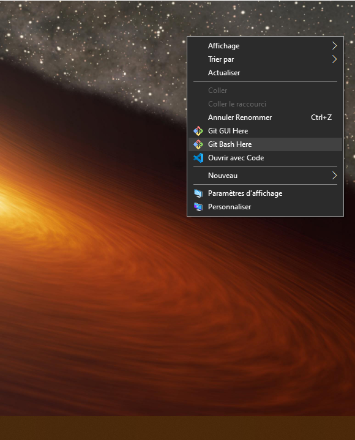
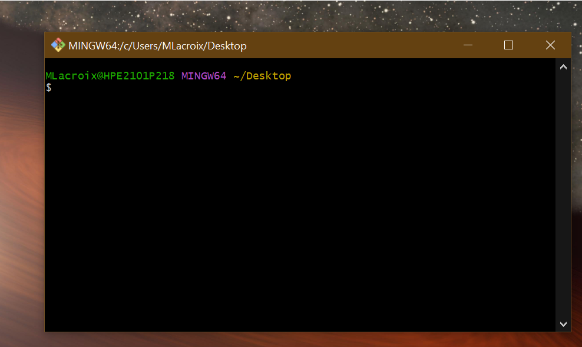

# Installation de l'environnement de travail

Cette documentation s'adresse aussi bien aux développeurs qu'aux rédacteurs qui souhaitent installer le site localement.

Pour les rédacteurs, cette documentation est technique mais vous permet de visualiser vos modifications et nouveaux articles dans un navigateur avant de les proposer en les poussant sur github.com.

## Prérequis

Pour disposer d'un environnement de travail confortable, il est recommandé de disposer des logiciels suivants :

-   **Visual Studio Code** (https://code.visualstudio.com/download) comme éditeur pour tous les langages utilisés par le site, notamment le markdown (mais vous pouvez utiliser un autre éditeur si vous préférez)
-   **NodeJS** (https://nodejs.org/en/download/prebuilt-installer) pour pouvoir construire le site localement sur votre poste de travail et le prévisualiser.
-   **Git** (https://gitforwindows.org/, lien pour Windows) pour interagir avec le dépôt de code et github.com.

Git et NodeJS sont indispensables pour aller plus loin dans l'installation.

## Installation

Sous Windows, après avoir installé _Git for Windows_, vous devriez avoir accès au clic droit dans l'explorateur à un menu contextuel "Git Bash here" qui vous permet de lancer une invite de commande qui est très adaptée à l'utilisation de Git et offre une bonne coloration syntaxique. Il est recommandé de la préférer à l'invite de commande par défaut de Windows.





Les lignes de commandes qui suivent pourront être copiées, puis collées (`maj+Inser`) et executées (`Entrée`) dans l'invite de commande qui a été ouverte.

### Dupliquer le dépôt

Il faut dupliquer le projet sur votre espace GitHub afin de pouvoir faire les changements de votre côté, les prévisualiser, puis les soumettre au dépôt principal.

Dans le coin supérieur droit de la page, cliquez sur `Dupliquer` ou `Fork` puis `Create a new fork`.


Dans le champ `Description`, vous pouvez taper la description de votre duplication. Si vous le souhaitez, sélectionnez Copier la branche PAR DÉFAUT uniquement.

Cliquez sur `Créer une duplication`.

Votre clone du dépôt sera disponible sous l'URL https://github.com/votre_pseudo_github/cartes.gouv.fr-documentation. Vous bénéficiez alors d'un espace de travail qui vous est propre. Vous pourrez choisir de soumettre au dépôt principal seulement les éléments que vous choisissez.


### Cloner le dépôt

Page d'explications : https://docs.github.com/fr/pull-requests/collaborating-with-pull-requests/working-with-forks/fork-a-repo

Clonez le dépôt (ou votre fork du dépôt, ce qui est préférable) sur votre poste de travail dans un nouveau dossier nommé `cartes.gouv.fr-documentation` :

```bash
git clone https://github.com/IGNF/cartes.gouv.fr-documentation
```

(en cas de problème, vérifiez votre configuration réseau. Si vous travaillez derrière un proxy, vérifiez par exemple vos variables d'environnement HTTP_PROXY et HTTPS_PROXY)

Rendez vous dans le dossier pour exécuter les commandes suivantes :

```bash
cd cartes.gouv.fr-documentation
```

### Installer les dépendances

```bash
npm install
```

Cette commande créé un sous-dossier `node_modules` dans lequel vont s'installer toutes les dépendances du projet, conformément à ce qui est décrit dans les fichiers `package.json` et `package-lock.json`.

### Exécuter Eleventy pour construire le site

```bash
npm run build
```

**Eleventy** est le logiciel utilisé pour construire le site. Il transforme les fichiers _markdown_ ou _nunjucks_ du dossier `content` en pages html à l'aide des gabarits du dossier `_includes`. Ensuite **Pagefind** indexe le contenu de ces pages pour que le moteur de recherche du site soit fonctionnel.

A l'issu de cette commande, le dossier `_site` est rempli ou modifié avec un contenu HTML, visualisable dans un navigateur.

### Déployer en local

```bash
npm start
```

Cette commande rend le site disponible à l'adresse `http://localhost:8080/fr/` et reste active, à l'écoute des changements que vous effectuez dans le projet.

**:sparkles: Vous avez maintenant réussi à déployer le site en local :sparkles:**

:warning: Il est normal que la page d'accueil soit une erreur 404. La page d'accueil réelle et correctement fléchée lors des déploiements en production est `/fr`.

Le site est ainsi maintenu à jour en même temps que vous modifiez des fichiers. Mais les contenus modifiés ne sont pas indexés pour la recherche et il peut arriver que certaines modifications ne soient pas immédiatement prises en compte. Dans ce cas, arrêtez le site (`Ctrl+C`) et relancez les 2 commandes précédentes : `npm run build` puis `npm start`.

Les développeurs peuvent exécuter un [mode de débogage](https://www.11ty.dev/docs/debugging/).
